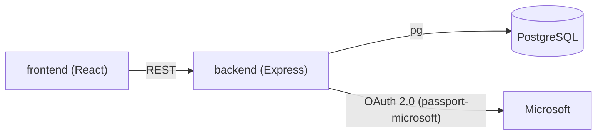

# Random Data Generator

Личный учебный проект (2023). Веб-сервис генерации тестовых данных через библиотеку Faker: выбор категории и функции Faker, языка, seed и количества записей, результат возвращается в JSON; после входа через учётную запись Microsoft (OAuth 2.0) настройки генератора сохраняются в PostgreSQL, по три слота на пользователя. Статус: учебный прототип.

## Архитектура

Два сервиса и база данных: React-веб-клиент, Express API, PostgreSQL. Обмен по REST, вход через Microsoft по протоколу OAuth 2.0.



| Сервис | Язык | Роль | Порт |
|---|---|---|---|
| frontend | JavaScript / React | веб-клиент: настройка генератора, вызовы REST API, отображение результата | 3000 |
| backend | Node.js / Express | REST API: каталог функций Faker, генерация, аутентификация, сохранение настроек | 3001 |
| PostgreSQL | SQL | таблица UserSaves: три слота сохранённых настроек на пользователя | 5432 |

## Ключевые технические решения

- Каталог функций Faker строится автоматически: на запрос GET /generator/options сервер обходит объект faker (локаль ru по умолчанию) и отфильтровывает служебные ключи (`_mersenne`, `locales`, `definitions` и другие) и часть функций helpers (`fake`, `unique`, `multiple`); полученный словарь «категория: список функций» отдаётся веб-клиенту и определяет содержимое интерфейса.
- Генерация через `faker.helpers.fake`: сервер собирает из полей запроса строку вида `{{category.func(params)}}` и возвращает массив результатов.
- Воспроизводимость по seed: если seed указан, перед каждой записью вызывается `faker.seed(Number(seed) + i)`, эталонная дата фиксируется на 2020-01-01; одинаковые параметры дают одинаковый результат. Без seed каждая запись случайна.
- Язык данных: сервер динамически подключает локаль Faker (`require("@faker-js/faker/locale/" + lang)`); перечень языков задан на веб-клиенте в `locales.json`.
- OAuth 2.0 через passport-microsoft: tenant `common`, scope `user.read`, адреса авторизации и token заданы явно (протокол v2.0); профиль пользователя сериализуется в сессию целиком (serializeUser без сокращений).
- Сессии на cookie-session: подпись cookie ключом из переменной SESSION_KEY, срок жизни задан в коде (24*60*60*100 мс, то есть 2,4 часа).
- CORS: разрешён единственный origin из CLIENT_URL, методы GET, POST, PUT, DELETE, credentials: true.
- PostgreSQL без ORM: пакет pg, все запросы параметризованы ($1, $2), значения не склеиваются с текстом запроса.
- Таблица UserSaves (id VARCHAR UNIQUE, save1, save2, save3 типа json) создаётся при старте сервера через CREATE TABLE IF NOT EXISTS; номер слота сервер вычисляет из storeID: save + (storeID - 1).
- Переопределён `BigInt.prototype.toJSON`: значения BigInt, возвращаемые Faker, корректно сериализуются в JSON.

## Стек

Node.js, Express 4, @faker-js/faker 8, passport, passport-microsoft, cookie-session, cors, dotenv, pg, nodemon · React 18, Create React App, MobX 6, react-router-dom 6, react-bootstrap, Bootstrap 5, axios, react-select, sass · PostgreSQL.

## Запуск

Нужны Node.js, npm и PostgreSQL. Файлы .env в git не входят, создайте их из шаблонов.

Backend:

```bash
cd backend
npm install
cp .env.template .env   # заполните значения
npm run run             # запуск через nodemon (скрипт "run" из package.json)
```

Альтернатива: `node src/index.js`. Перед первым запуском создайте базу и пользователя PostgreSQL и пропишите их в DB_CONLINK (пример команд в комментарии в backend/src/save/save.js): таблица UserSaves создастся сама при старте. Для входа зарегистрируйте приложение Microsoft и укажите redirect URI: `<SERVER_URL>/auth/microsoft/callback`.

Frontend:

```bash
cd frontend
npm install
cp .env.template .env
npm start
```

Веб-клиент откроется на http://localhost:3000 (стандартный порт Create React App), API: http://localhost:3001.

Переменные окружения (без секретов):

| Файл | Переменные |
|---|---|
| backend/.env | CLIENT_ID, CLIENT_SECRET: данные приложения Microsoft; CLIENT_URL: адрес веб-клиента; SERVER_URL: публичный адрес сервера; PORT=3001; SESSION_KEY: ключ подписи cookie-session; DB_CONLINK: строка подключения к PostgreSQL |
| frontend/.env | REACT_APP_API_URL: адрес API, например http://localhost:3001; BROWSER=none |

> Примечания: по истории git-коммитов (май 2023) проект запускали на Render.com (коммиты «Test 1 for Render.com», «Test 2 for Render»), конфигурация развёртывания в репозиторий не входит. Локально проверено на Node.js 22: сервер стартует без PostgreSQL (ошибка создания таблицы уходит в лог), GET /generator/options отдаёт каталог, два POST /generator/generate с одним seed вернули одинаковый результат. Без заполненного .env сервер при старте падает с ошибкой OAuth2Strategy requires a clientID option.

## REST API (backend, порт 3001)

- `GET /auth/microsoft`: начало входа, перенаправление на страницу Microsoft.
- `GET /auth/microsoft/callback`: обработка ответа OAuth 2.0, создание записи пользователя в базе, перенаправление на веб-клиент.
- `GET /auth/login/success`: данные текущего пользователя в JSON, без сессии отдаёт 403 (требует входа).
- `GET /auth/login/failed`: сообщение о неудачном входе, всегда 401.
- `GET /auth/logout`: выход, перенаправление на веб-клиент.
- `GET /generator/options`: каталог функций Faker по категориям, без входа.
- `POST /generator/generate`: генерация данных, тело запроса: category, func, lang, seed, count, params, без входа.
- `GET /save/get`: три сохранённых набора настроек пользователя (требует входа).
- `POST /save/save`: сохранение набора настроек в слот по storeID (требует входа).

## Структура репозитория

```
Random-data-generator-website/
├── backend/                  # Express API
│   ├── .env.template         # шаблон переменных окружения
│   └── src/
│       ├── auth/             # passport-microsoft, маршруты входа и выхода
│       ├── generator/        # обход объекта faker, генерация данных
│       ├── save/             # PostgreSQL: таблица UserSaves, три слота настроек
│       └── index.js          # сессии, CORS, подключение маршрутов
└── frontend/                 # веб-клиент (Create React App)
    ├── .env.template
    └── src/
        ├── components/       # страницы: приветственная, генератор, документация Faker
        ├── routes/           # маршруты: /, /doc, /generator
        └── store/            # MobX-хранилища пользователя и настроек
```

## Ограничения

- Тестов нет: скрипт test в backend/package.json завершается ошибкой-заглушкой, тестовых файлов в репозитории нет.
- Миграций нет: единственная таблица создаётся при старте через CREATE TABLE IF NOT EXISTS, изменения схемы не автоматизированы.
- POST /generator/generate доступен без входа и не ограничивает count: объём генерации контролирует только клиент.
- Ошибка генерации возвращается со статусом 200 строкой «Ошибка: ...» вместо кода ошибки.
- Профиль Microsoft сохраняется в cookie сессии целиком, без сокращения состава данных.
- Кнопка входа на веб-клиенте открывает /auth/microsoft/callback напрямую, минуя /auth/microsoft; полный цикл входа не проверялся.
